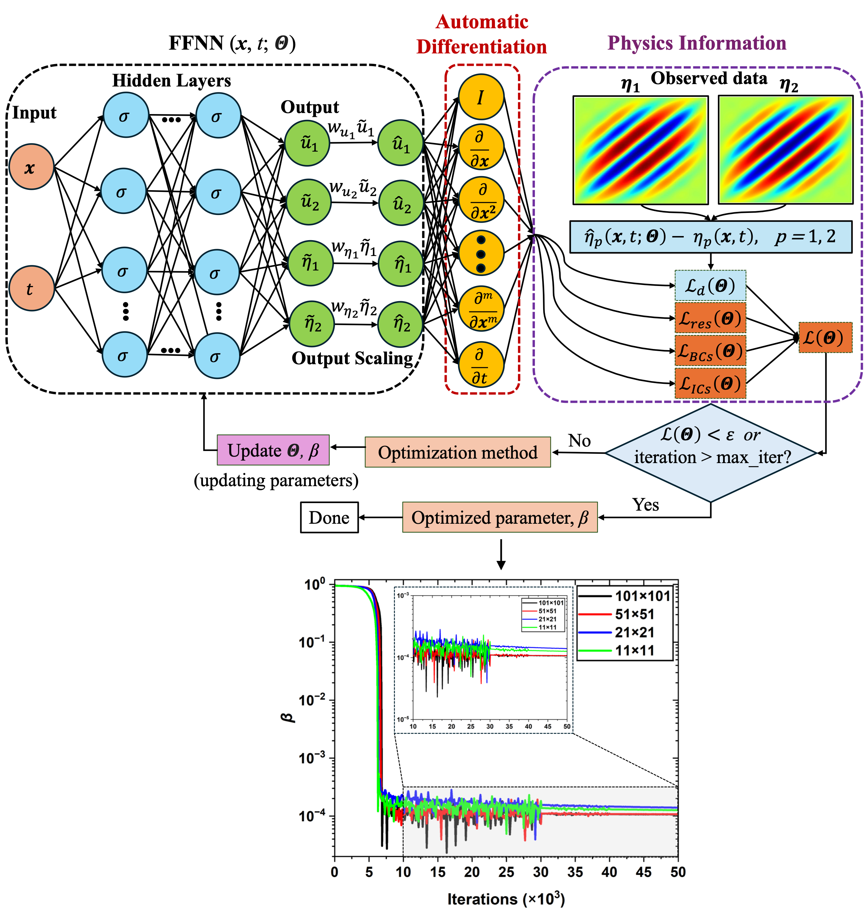

# PhaseField_PINN-MT

*Physics-informed neural networks for forward simulation and inverse parameter estimation in 2D martensitic phase transformations.*

---

## Overview

This repository contains the research code accompanying the paper:

**Asfandyar Khan** and **Mahmood Mamivand**  
*Physics-Informed Neural Networks for Martensitic Transformation: Toward Morphology-Based Material Parameters Estimation*  
**Physica Scripta**  
**DOI:** `10.1088/1402-4896/ae5fe5`  
**Paper Link:** [Read the paper on IOPscience](https://iopscience.iop.org/article/10.1088/1402-4896/ae5fe5)

This repository provides implementations of **physics-informed neural networks (PINNs)** for a **2D martensitic phase-field model** governed by coupled **time-dependent Ginzburg-Landau (TDGL)** and **mechanical equilibrium equations**.

The framework includes:

- **Forward PINN** for predicting spatiotemporal microstructure evolution from prescribed initial conditions
- **Inverse PINN** for morphology-based estimation of the gradient energy coefficient from sparse, partial, and noisy observations

This repository is intended to support reproducible research and open scientific dissemination by providing code, input files, and representative datasets for reuse by other researchers.

## Overview Figure

<p align="center">
  
</p>

<p align="center">
  <em>Overview of the inverse PINN framework for inverse parameter estimation in 2D martensitic phase transformations. Figure adapted from the associated paper by Khan and Mamivand, Physica Scripta, 2026.</em>
</p>

---

## Repository Structure

```text
PhaseField_PINN-MT/
├── Forward_PINN/
├── Inverse_PINN/
├── assets/
├── CITATION.cff
├── LICENSE
├── README.md
└── requirements.txt
```

---

## Scientific Scope

Martensitic transformations are modeled using a coupled phase-field + mechanics formulation. The PINN framework is used to:

- Solve the forward TDGL–mechanical equilibrium system
- Estimate the gradient energy coefficient
- Evaluate performance under:
  - sparse observations
  - partial-domain observations
  - noisy observations

---

## Quick Start

**1. Clone the repository**
```bash
git clone https://github.com/AsfandyarKhan72/PhaseField_PINN-MT.git
cd PhaseField_PINN-MT
```

**2. Install dependencies**
```bash
pip install -r requirements.txt
```

**3. Run the Forward PINN example**
```bash
python Forward_PINN/MT_Forward_PINN.py
```

**4. Run the Inverse PINN example**
```bash
python Inverse_PINN/MT_Inverse_PINN.py
```

> Depending on your environment, hardware, and DeepXDE backend configuration, runtime may vary.

---

## Installation

It is recommended to use a clean Python environment:

```bash
python -m venv venv
source venv/bin/activate
pip install --upgrade pip
pip install -r requirements.txt
```

### Core dependencies

- NumPy
- Matplotlib
- SciPy
- PyTorch
- DeepXDE
---

## Model Summary

The PINN formulation includes:

- 2D coupled TDGL + mechanical equilibrium equations
- Cubic-to-tetragonal martensitic transformation
- Periodic boundary conditions for phase-field variables
- Gaussian initial perturbations
- Output scaling for improved optimization stability
- Sequential time marching
- Adaptive residual-based refinement

---

## Dataset / Input Files

The repository includes reference and observation data files used in the forward and inverse PINN studies.

### Forward PINN data

- **`t_1_FEM.txt`** — FEM reference microstructure data used for comparison with the forward PINN prediction.

### Inverse PINN data

- **`grid_11x11.txt`**, **`grid_51x51.txt`**, **`grid_101x101.txt`** — sparse observation cases with different sampling densities.
- **`grid_11x11_firsthalf.txt`**, **`grid_11x11_secondhalf.txt`** — partial-domain observation cases.
- **`grid_11x11_noise_5pct.txt`**, **`grid_11x11_noise_20pct.txt`**, **`grid_11x11_noise_50pct.txt`** — noisy observation cases with different noise levels.
- **`gridIC_11x11.txt`**, **`gridIC_51x51.txt`**, **`gridIC_101x101.txt`** — initial-condition related observation datasets used in inverse PINN studies.

These files are included to support reproducibility and to demonstrate parameter estimation under different observation conditions.

---

## Citation

If you use this repository in your research, please cite:

```bibtex
@article{khan2026pinnmt,
  author  = {Asfandyar Khan and Mahmood Mamivand},
  title   = {Physics-Informed Neural Networks for Martensitic Transformation: Toward Morphology-Based Material Parameters Estimation},
  journal = {Physica Scripta},
  year    = {2026},
  doi     = {10.1088/1402-4896/ae5fe5}
}
```

---

## Contact

Asfandyar Khan  
PhD Student, Materials Science and Engineering  
Boise State University

---

## License

Released under the MIT License. See `LICENSE` for details.
